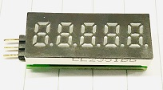
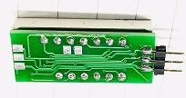

# STM8LED

STM8LED is a project to simplify display method with LEDs. The idea is to make it as an independent sub-module and as smaller as possible. The firmware is designed to support 5-led display with 8 segments.

# Feature

On hardware side, the board can be powered from 2.95V to 5.5V directly. It only uses three pins to control content to display. On firmware side, it has below advanced features:
* Use a customized UART protocol to pass commands to stm8led.
* The characters to display is programmed by command.
* The contrast can be programmed.
* Each LED can be commanded to blink, and the blink speed can be programmed.
* The displayed content can automatically scroll left if it's too long to display.
* The scroll speed can be programmed.

# Hardware

The MCU used is STM8S003 which is super low cost. With some PNP transistor to drive common node of LED and GPIO to drive LED directly, the hardware is pretty simple. Check schematics for more detail.

# Firmware

The hardware related code are in file led.c/.h usart.c/.h. The library EZLED calls low level hardware to control LEDs. The library manage the animation things. The USART is RX only. The data is stored to FIFO in USART ISR. In the main loop, we check the FIFO periodically and if there is data, pass it to serial_frame which decode the raw data to a frame. Once the frame reception is completed, pass the frame to commands to process the command. If the command is found successfully, call the command with received parameter.

## UART Protocol (serial-frame)

As mentioned above, the protocol contains low-level protocol to encode/decode a frame. And a protocol to define a command.

The serial frame is similar to HLDC . 

The frame is started by a start-flag(0x7d) and followed one byte to indicate the frame length. Then coming the data. As 0x7d is marked as start-flag, so any data equals to 0x7d is escaped in following way:

Define 0x7e as escape character. 0x7e should always come together with a second byte. In specific, if there is data 0x7d, escape it with two bytes 0x7e+(0x7d^0x20). If data 0x7e shows up, escape it with 0x7e+(0x7e^0x20).

After the data section, use stop-flag(0x7c) to mark end of frame. Similar to 0x7d and 0x7e, if 0x7c shows up in data, escape it with 0x7e+(0x7c^0x20). If an unexpected stop-flag is received, the parser will reset to init state to wait for start-flag.

## Command format

Once we have a valid frame, we can easily define the command format:

1Byte command code + 1Byte parameter length in byte + parameter bytes

# License
Coming...